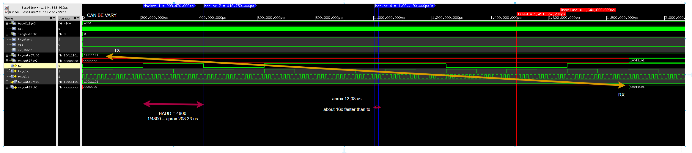

# ⚙️ UART

This directory contains the basic UVM-based implementation for UART (Universal Asynchronous Receiver/Transmitter) protocol.
#### The RTLs used to understand the concepts have been developed and can be found in Kumar Khandagle's courses (credit to him).
---

## Protocol Overview

UART is a point-to-point, asynchronous serial communication protocol widely used for data transmission between digital systems.

### Key Concepts

- **Asynchronous** communication (no shared clock)
- Serial data transmission including:
  - **Start bit** (logic low)
  - **Data bits**
  - **Optional parity bit**
  - **Stop bit(s)** (logic high)
- Baud rate must be pre-agreed between transmitter and receiver

| Signal | Direction              | Description                       |
| ------ | ---------------------- | --------------------------------- |
| `TX`   | Transmitter → Receiver | Serial transmission line          |
| `RX`   | Receiver ← Transmitter | Serial reception line             |
| `clk`  | Internal               | Sampling clock                    |
| `rst`  | Internal               | Asynchronous or synchronous reset |

---

### How It Works

1. Line is idle (logic high).
2. Transmission starts with a **start bit** (logic low).
3. Data bits are sent (usually LSB first).
4. An optional **parity bit** is sent.
5. One or more **stop bits** end the frame.

---

### Waveform

## 📂 Directory Structure

- `agent/` – UVM agent components: driver, monitor, transaction, agent  
- `clk_gen/` – UART clock divider (baud rate generator)  
- `env/` – Environment-level components (env, scoreboard, config)  
- `if/` – UART interface definition  
- `RTL/` – UART RTL design files (tx, rx, top UART)  
- `sequences/` – Sequence items and stimulus generators  
- `test/` – UVM test classes  
- `tb.sv` – Top-level testbench module (DUT + environment)

---
